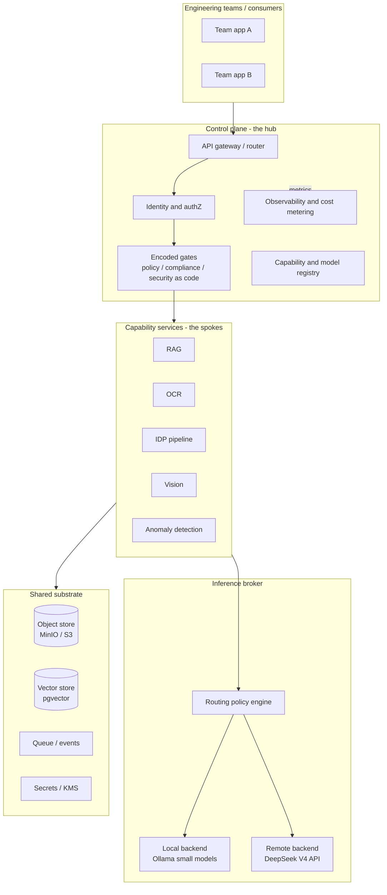
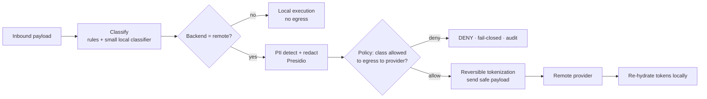

# AI Platform Specification — Enterprise Capability Platform (Hobby/Reference Build)

| | |
|---|---|
| **Status** | Draft v0.1 (for review) |
| **Author** | Dane Balia |
| **Date** | 2026-06-14 |
| **Audience** | Engineering teams consuming AI capabilities; platform builder/maintainer |
| **Constraint envelope** | 16GB M4 Mac mini · remote-first inference · cost-minimal · AWS-shaped, lift-shift later |
| **Pricing facts** | Verified June 2026 (DeepSeek V4 line). Re-verify before committing a budget. |

---

## 1. Purpose & scope

Build a reference **AI Platform** that exposes common enterprise AI capabilities — RAG, OCR, Intelligent Document Processing (IDP), Vision, Anomaly Detection — as **consumable, composable services** behind stable contracts, so engineering teams self-serve instead of each team rebuilding the same plumbing.

The platform is explicitly designed so that:

- The **patterns and seams map onto AWS managed services** (Bedrock, Textract, Rekognition, SageMaker, OpenSearch, S3, Step Functions), so the mental model transfers and a future lift-shift is a swap of implementations behind unchanged contracts — not a redesign.
- **Heavy inference is remote-first** (DeepSeek V4 API), with **local execution only where it is cheap, private, or offline-appropriate** (embeddings, OCR, small classifiers, anomaly models).
- **Security is a first-class concern**, expressed as *encoded gates* (policy-as-code, compliance-as-code, security-as-code) at the control plane — because remote-first inference means **data leaves the building**, and the egress gate is therefore the single most important control in the system.

Out of scope for v0.1: model training/fine-tuning pipelines (treated as a future SageMaker-shaped spoke), production multi-region HA, and real-money AWS deployment (covered as a dry-run path only).

---

## 2. Goals, outcomes & success criteria

**Outcomes (your stated ones, sharpened):**

1. A reusable **template** for an enterprise AI platform — contracts + reference implementation, not a monolith.
2. A **low-cost** stack others can adopt conceptually and run on modest hardware.
3. Surface the real **pain points** of designing, building and supporting such a platform (documented in §15, not discovered the hard way).
4. A concrete, justified **technology selection** (§13).
5. **AWS parity** at the level of patterns/seams, with a costed verdict on when (if ever) to touch real AWS (§12, §14 P5).
6. A clear, demonstrable **emphasis on security** (§10).

**Success criteria:**

- **SC1 — Works, AWS-shaped.** A request flows client → control plane → capability → inference broker → result, with the same shape an AWS deployment would have.
- **SC2 — Composable.** Each capability spins up independently *and* chains into pipelines (IDP is literally OCR → extract → structure → validate → anomaly-check chained).
- **SC3 — Learnable.** Design/build/support lessons are captured as ADRs and a pain-point register.

---

## 3. Design principles

1. **Capability-as-a-product.** Each capability is an independently deployable service with a uniform request/response envelope, an SLA, an owner, and a contract. Consumers depend on the contract, never the implementation.
2. **Inference is a pluggable backend.** No capability calls a model provider directly. All inference goes through a **broker** that routes per-capability to local or remote backends based on policy. This is what makes both "remote-first" and "lift-shift" cheap to change later.
3. **Encoded gates, fail-closed.** Policy/compliance/security are code that runs *in the request path*, not documents that live in a wiki. The default decision on anything ambiguous is **deny**.
4. **AWS-shaped seams.** Every shared service has an AWS north-star, a local analog, and (for inference) a remote API. The seam is an interface; the implementation is swappable.
5. **Local-first only where it pays.** Local = free + private but RAM-bound. Use it for embeddings, OCR, small classifiers, anomaly models. Push everything else remote.
6. **Async by default.** The 16GB ceiling and Textract's own model both push toward submit-job → poll/callback. Sync is sugar over async, not the other way round.
7. **Provenance on everything.** Every response carries which backend served it, token counts, cost, latency, confidence, and what gates fired. You cannot govern or cost-attribute what you don't measure.

---

## 4. Mental model — hub-and-spoke / platform-as-a-product

This is the validated model: a central **hub** (control plane) provides cross-cutting concerns once, and **spokes** (capability services) provide domain functionality. Teams consume spokes through the hub; they never wire cross-cutting concerns themselves.

- **Hub** owns: gateway/routing, identity & authZ, encoded gates, capability + model registry, observability + cost metering.
- **Spokes** own: a single capability each (RAG, OCR, IDP, Vision, Anomaly).
- **Broker** sits between spokes and model backends.
- **Substrate** provides object store, vector store, queue/events, secrets.

---

## 5. Reference architecture



---

## 6. AWS north-star ↔ local analog ↔ remote API (the lift-shift table)

This table is the contract for portability. Build against the **local analog**; keep the **AWS column** as the interface you target; reach for the **remote API** only for heavy inference.

| Platform concern | AWS north-star | Local analog (build on this) | Remote API (heavy inference) |
|---|---|---|---|
| Model gateway | Bedrock | **LiteLLM** proxy + Ollama | DeepSeek V4 (Flash/Pro) |
| Foundation-model inference | Bedrock | Ollama (one small model hot) | `deepseek-v4-flash` / `-pro` |
| Embeddings | Bedrock Titan | Ollama `nomic-embed` / `bge-small` | (optional API embeddings) |
| OCR / doc text+layout | Textract | **Tesseract + PaddleOCR/docTR** | DeepSeek V4 vision (VQA/layout) |
| Vision / image understanding | Rekognition | local CLIP / YOLO (small) | DeepSeek V4 vision |
| IDP (compose) | Textract+Comprehend+Bedrock+Step Fns | pipeline of the above | composed |
| Anomaly detection | Lookout / SageMaker RCF | **PyOD / river / scikit-learn** | n/a (keep local — cheap) |
| Custom model host (future) | SageMaker | local FastAPI + model | n/a |
| Object storage | S3 | **MinIO** (S3 API) / LocalStack S3 | n/a |
| Vector store | OpenSearch / Aurora pgvector | **Postgres + pgvector** (or Qdrant) | n/a |
| Queue / events | SQS / SNS / EventBridge | LocalStack / NATS / Redis Streams | n/a |
| Orchestration | Step Functions | lightweight DAG runner / Prefect | n/a |
| API gateway | API Gateway | Traefik / Caddy | n/a |
| Identity | Cognito / IAM | **Keycloak** (OIDC) | n/a |
| Secrets / KMS | Secrets Manager / KMS | SOPS + age / local Vault | n/a |
| Guardrails | Bedrock Guardrails | **Presidio** (PII) + **OPA/Rego** (policy) | (optional API guardrails) |
| Observability | CloudWatch / X-Ray | **OpenTelemetry** + Grafana/Loki/Tempo/Prom | n/a |
| IaC | CloudFormation | **Terraform** (targets LocalStack now, AWS later) | n/a |

The two bolded enablers — **LiteLLM** (model gateway) and the **encoded gates** (Presidio + OPA) — are what make this platform distinctively cheap *and* governable.

---

## 7. Core platform contracts

The uniform envelope is what delivers SC2 (composable). Every capability speaks the same shape, so any output can feed any input and the orchestrator can chain them blindly.

**Request envelope**

```jsonc
{
  "capability": "rag",                // rag | ocr | idp | vision | anomaly
  "operation": "query",              // capability-specific verb
  "context": {
    "tenant_id": "team-market-risk",
    "principal": "svc-account-or-user",
    "trace_id": "uuid",
    "data_classification": "internal", // public | internal | confidential | restricted
    "residency": "any"                 // any | on_prem_only
  },
  "payload": { /* inline OR { "object_ref": "s3://bucket/key" } */ },
  "options": {
    "mode": "async",                  // async (default) | sync
    "backend_hint": null,             // advisory only; policy can override
    "max_cost_usd": 0.05              // per-request ceiling
  }
}
```

**Response envelope**

```jsonc
{
  "job_id": "uuid",
  "status": "succeeded",             // queued | running | succeeded | failed | denied
  "result": { /* capability-specific */ },
  "provenance": {
    "backend_used": "deepseek-v4-flash",
    "tokens_in": 1840, "tokens_out": 420,
    "cost_usd": 0.000376,
    "latency_ms": 1320,
    "confidence": 0.86
  },
  "gates": {
    "classification": "internal",
    "redactions_applied": 0,
    "egress_decision": "allowed"      // allowed | denied | redacted_then_allowed
  }
}
```

**Async job model.** Submit returns `202` + `job_id`. Consumers poll `GET /jobs/{id}` or register a callback. This mirrors Textract's async API and accommodates the 16GB reality (a local model may need to load before serving). Sync mode simply blocks on the same machinery for small/fast operations.

---

## 8. The inference broker & routing policy

The broker is the heart of "remote-first + pluggable." **Recommendation: use LiteLLM** as the broker — it exposes one OpenAI-compatible endpoint, routes to DeepSeek *and* Ollama, enforces per-key budgets, and tracks token cost out of the box. That is effectively a Bedrock-shaped gateway for free.

**Routing policy (policy-as-code, evaluated per request):**

```yaml
# Evaluated top-to-bottom; first match wins. Fail-closed.
rules:
  - when: { classification: [confidential, restricted] }
    then: { backend: local_only, on_unavailable: deny }     # never egress sensitive data
  - when: { residency: on_prem_only }
    then: { backend: local_only, on_unavailable: deny }
  - when: { task: embedding }
    then: { backend: local, model: nomic-embed-text }        # cheap + private, fits RAM
  - when: { task: ocr_raw_text }
    then: { backend: local, engine: tesseract }              # CPU, free, no egress
  - when: { task: heavy_reasoning }
    then: { backend: remote, model: deepseek-v4-pro }
  - when: { task: vision_understanding }
    then: { backend: remote, model: deepseek-v4-flash, modality: image }
  - default:
    then: { backend: remote, model: deepseek-v4-flash }      # workhorse
cost_ceiling:
  per_request_usd: 0.05
  per_tenant_daily_usd: 2.00
```

**Why DeepSeek V4 specifically:** `deepseek-v4-flash` is the workhorse ($0.14/$0.28 per M tokens, 1M context, thinking + non-thinking modes, **native multimodal so it also serves vision/IDP**), and `deepseek-v4-pro` ($0.435/$0.87) is reserved for genuinely hard reasoning. The API is OpenAI-compatible (and Anthropic-compatible at a second base URL), so LiteLLM treats it as a drop-in.

> **Migration note (live example of a support pain point):** the legacy aliases `deepseek-chat` / `deepseek-reasoner` are **retired after 2026-07-24**. Pin `deepseek-v4-flash` / `deepseek-v4-pro` explicitly in the registry, never the aliases. New accounts also get ~5M free tokens, which comfortably covers early dev.

---

## 9. Capability specifications

Each spoke is defined by: AWS analog · local/remote split · contract verbs · 16GB notes.

### 9.1 RAG
- **AWS analog:** Bedrock Knowledge Bases / Kendra + OpenSearch.
- **Split:** ingestion + embeddings = **local** (`nomic-embed`); retrieval = **local** (pgvector); generation = **remote** (`v4-flash`); optional rerank = **local small** or skip.
- **Verbs:** `ingest(object_ref)`, `query(question, top_k)`, `reindex(collection)`.
- **16GB notes:** embeddings model (~0.5–1GB) + Postgres are fine to keep hot. Generation is remote so no LLM RAM cost. This is the most RAM-friendly capability.

### 9.2 OCR
- **AWS analog:** Textract (raw text/`DetectDocumentText`).
- **Split:** **local-first** — Tesseract for clean text, PaddleOCR/docTR for layout/tables. Vision model only when documents are messy/handwritten/visual.
- **Verbs:** `extract_text(object_ref)`, `extract_layout(object_ref)`.
- **16GB notes:** Tesseract is CPU, negligible RAM, **zero egress** — ideal default. Big privacy + cost win.

### 9.3 IDP (Intelligent Document Processing)
- **AWS analog:** Textract + Comprehend + Bedrock orchestrated by Step Functions.
- **Composition (proves SC2):** `OCR.extract_layout` → `classify(doc_type)` → `extract_fields(schema)` via `v4-flash` (structured JSON output) → `validate(rules)` → `anomaly.check`. Each step is a standard envelope call; the orchestrator just chains them.
- **Verbs:** `process(object_ref, schema, ruleset)`.
- **16GB notes:** runs as an async DAG; only one heavy step is "live" at a time, which suits the hardware.

### 9.4 Vision
- **AWS analog:** Rekognition (labels, detection) + Bedrock multimodal.
- **Split:** simple labels/detection = **local small** (CLIP/YOLO) where it fits; understanding/VQA = **remote** (`v4-flash` vision).
- **Verbs:** `describe(object_ref)`, `detect(object_ref, labels)`, `ask(object_ref, question)`.
- **16GB notes:** do **not** keep a local vision model and a local LLM hot simultaneously — route understanding remote.

### 9.5 Anomaly detection
- **AWS analog:** Lookout for Metrics / SageMaker Random Cut Forest.
- **Split:** **fully local** — PyOD (Isolation Forest, ECOD), `river` for streaming, scikit-learn for batch. No egress, no API cost.
- **Verbs:** `fit(dataset)`, `score(records)`, `stream_score(record)`.
- **16GB notes:** tiny models, trivially fits. Best ROI: free, private, fast.

---

## 10. Security architecture (emphasis)

Because inference is remote-first, the platform's defining security control is the **egress gate**: a fail-closed pipeline that decides whether — and in what form — a payload may leave for a remote provider. This is the *encoded gates* thesis made concrete.

**Egress gate flow (runs in the request path before any remote call):**



**Controls, mapped to encoded-gates categories:**

- **Security-as-code:** PII redaction (Presidio) + reversible tokenization vault before egress; secrets via SOPS+age / KMS; no raw sensitive payloads ever logged (log hashes + classification only); least-privilege service identities (Keycloak/IAM).
- **Policy-as-code:** OPA/Rego decides egress, backend selection, and quotas. Default deny. Confidential/restricted data is `local_only` by rule.
- **Compliance-as-code:** every request emits an immutable audit record (who, what classification, which backend, what gates fired, cost). This is your evidence trail and maps directly to SR 11-7 / model-risk expectations you already work with.
- **Tenancy:** per-tenant keys, budgets, and collections; tenant isolation enforced at gateway + data layer.
- **Guardrails:** prompt-injection and output checks at the spoke boundary (relevant for RAG over untrusted documents).

**The scary failure mode to design against:** a redaction *false negative* that lets sensitive data egress. Mitigations: conservative classifier, deny-on-uncertainty, sampling-based human review of egress logs, and treating "remote" as off-limits for `restricted` regardless of redaction.

---

## 11. The 16GB M4 reality

The binding constraint. Plan the RAM budget explicitly.

| Resident | Approx RAM |
|---|---|
| macOS + OrbStack + containers (Postgres, MinIO, LiteLLM, services) | ~5–7 GB |
| One local embedding model (`nomic-embed`) | ~0.5–1 GB |
| One small local LLM **only if needed** (Qwen2.5-7B / Llama-3.1-8B, Q4) | ~5–6 GB |
| Headroom | the rest |

**Rules that fall out of this:**
- **One local model hot at a time.** Lazy-load on first use, unload on idle. Never co-host a vision model + an LLM locally.
- Treat the mini as **control plane + light local capabilities**, not a GPU farm. Embeddings, OCR, anomaly stay local; LLM + vision go remote.
- Async job model lets a model load (cold start) without blocking the API.
- If you find yourself wanting two heavy local models, that's the signal to route one of them remote — the architecture already supports it with a one-line registry change.

---

## 12. Cost model

**Local capabilities (embeddings, OCR, anomaly): ~$0** beyond electricity.

**Remote inference (DeepSeek V4 Flash, $0.14 in / $0.28 out per M tokens):**

| Operation | Rough tokens | Cost / op |
|---|---|---|
| RAG query | ~2,000 in + 500 out | **~$0.00042** |
| IDP field extraction (1 doc, structured) | ~3,000 in + 800 out | **~$0.00064** |
| Vision "understand this page" | ~image + 600 out | **~$0.001–0.003** |
| Hard reasoning (v4-pro, occasional) | ~4,000 in + 1,500 out | **~$0.003** |

**Illustrative monthly hobby load:** 5,000 RAG queries + 1,000 doc extractions + 500 vision calls ≈ **under US$5/month**. Prompt-caching (cache-hit input ~$0.0028/M) and the 5M free signup tokens push early development effectively to ~$0.

**Contrast with real AWS** (why local analog wins for a hobby): Textract bills per page, Bedrock per token (at higher rates), OpenSearch bills hourly whether idle or not, plus NAT/data-transfer. An always-on AWS equivalent is tens of dollars/month at idle before you process anything. **Verdict:** keep AWS as the *target shape*, not the *runtime*, until there's a reason to deploy. Use real AWS only for a brief, scripted free-tier smoke test (§14 P5), then tear it down.

---

## 13. Technology & tool selection

| Layer | Pick | Rationale |
|---|---|---|
| Containers | OrbStack (you have it) + docker-compose | light on the M4; fast |
| Model gateway / broker | **LiteLLM** | OpenAI-compatible; routes DeepSeek+Ollama; budgets + cost tracking = Bedrock-shaped for free |
| Remote LLM/vision | **DeepSeek `v4-flash`** (workhorse), `v4-pro` (hard) | cheapest frontier-class; native multimodal; OpenAI-compatible |
| Local LLM (optional) | Qwen2.5-7B-Instruct Q4 via Ollama | best small model that fits; only when offline/private needed |
| Embeddings | `nomic-embed-text` (Ollama) | small, strong, local, free |
| Vector store | Postgres + **pgvector** | Aurora-pgvector analog; one DB for data + vectors |
| Object store | **MinIO** | drop-in S3 API |
| AWS-shaped infra | **LocalStack** (community) | S3/SQS/SNS/Lambda locally, free |
| OCR | **Tesseract** + PaddleOCR/docTR | free, CPU, no egress |
| Anomaly | **PyOD** + `river` + scikit-learn | RCF-analog; tiny footprint |
| Orchestration | FastAPI services + light DAG runner (or Prefect) | Step-Functions analog; async jobs |
| Identity | **Keycloak** | Cognito analog; OIDC |
| Secrets | SOPS + age (or local Vault) | git-friendly, KMS-analog |
| Guardrails | **Presidio** (PII) + **OPA/Rego** (policy) | the encoded gates |
| Observability | OpenTelemetry + Grafana/Loki/Tempo/Prometheus | CloudWatch/X-Ray analog |
| Portable IaC | **Terraform** | one definition → LocalStack now, AWS later |

---

## 14. Build & test plan (phased)

**P0 — Walking skeleton (prove the seam).** Control plane (gateway + auth stub) + LiteLLM broker + one trivial capability (`summarize`) end-to-end, with the full envelope, provenance, and a **stub local provider**. Goal: a request flows the whole path and returns provenance. *This is the most important phase — it validates the contract before any capability complexity.*

**P1 — RAG.** pgvector + local embeddings + remote generation. Add contract tests + a small golden eval set (questions → expected facts).

**P2 — OCR + IDP.** Tesseract local; compose OCR → extract → validate into the IDP DAG. Proves SC2.

**P3 — Vision + Anomaly.** Add the remaining spokes; vision routes remote, anomaly stays local.

**P4 — Security hardening.** Wire the egress gate: classification, Presidio redaction, OPA policies, audit log, fail-closed denial. Add adversarial tests (prompt injection via RAG docs; redaction-bypass attempts).

**P5 — AWS lift-shift dry run.** Terraform targeting LocalStack for full parity; then *optionally* a scripted, time-boxed real-AWS smoke test on free tier (S3 + one Bedrock call), captured and torn down same session.

**Testing affordably (key techniques):**
- **Record/replay stub provider.** Record real DeepSeek responses once; replay in CI so **no test ever calls a paid API.** This is the single biggest cost control for testing.
- **Contract tests** against the envelope — provider-agnostic, catch drift (e.g. the alias deprecation) early.
- **Golden-file / snapshot tests** for deterministic steps (OCR, extraction schemas); rubric-based eval (cheap judge or cached) for generative steps.
- **LocalStack** for infra integration tests — free.
- Load/soak only against the **stub**, never the live API.

---

## 15. Anticipated pain points (so they're chosen, not discovered)

- **RAM thrash on 16GB** — model swap latency; mitigated by one-model-at-a-time + remote routing.
- **Egress governance is the hard part** — redaction false negatives are the scary failure; fail-closed and never egress `restricted`.
- **Eval is the real cost of an AI platform** — non-determinism, drift, and provider deprecations (the alias retirement is a live example). Invest in record/replay + golden sets early.
- **Cost attribution per tenant/capability** is fiddly — solved only if provenance is captured on every response from day one.
- **Local-analog ↔ AWS drift** — LocalStack is not 100% AWS; keep the smoke test to catch parity gaps before you trust the lift-shift.
- **Async complexity** — necessary, but adds job-state, polling/callbacks, and partial-failure handling to every capability.
- **Vendor concentration on DeepSeek** — mitigated by the OpenAI-compatible broker (swap models in the registry), but vision payload formats still differ between providers, so keep that adapter isolated.
- **Observability cardinality** — per-tenant per-capability metrics can explode; budget label cardinality deliberately.

---

## 16. Decision log (ADRs)

| ADR | Decision | Status |
|---|---|---|
| 001 | Capability-as-a-product behind a uniform request/response envelope | Accepted |
| 002 | Inference is a pluggable backend behind a broker (LiteLLM) | Accepted |
| 003 | Remote-first default `deepseek-v4-flash`; `v4-pro` for hard reasoning; local for embeddings/OCR/anomaly | Accepted |
| 004 | Encoded gates (policy/compliance/security-as-code) in the request path; fail-closed egress | Accepted |
| 005 | AWS-shaped seams; LocalStack + MinIO + pgvector as local analogs; Terraform as portable definition | Accepted |
| 006 | Async job model as the default capability interface; sync as sugar | Accepted |
| 007 | Provenance + cost metering on every response | Accepted |
| 008 | Record/replay stub provider for CI; no paid calls in tests | Accepted |
| 009 | Single local model hot at a time; lazy load / idle unload | Accepted |
| 010 | PII redaction (Presidio) + reversible tokenization before any remote egress | Accepted |
| 011 | Single-tenant: tenancy modelled in the envelope (`tenant_id`) but not enforced at the infra level | Accepted |
| 012 | RAG is the flagship capability (P1); it is the most RAM-friendly and universally applicable spoke | Accepted |
| 013 | LocalStack parity is sufficient; P5 real-AWS smoke test is dropped from scope | Accepted |
| 014 | Proper eval harness from P1 onward (not just golden-file snapshots); learning best practices is the goal | Accepted |
| 015 | RAG UX is batch async: POST query → 202 + job_id → poll GET /jobs/{id}; streaming is a future enhancement | Accepted |

---

## 17. Resolved decisions & next steps

All open questions from draft v0.1 are now closed (see ADRs 011–015).

| # | Question | Decision | Rationale |
|---|---|---|---|
| 1 | Multi-tenancy depth | **Single-tenant** — tenancy modelled in envelope, not enforced at infra | Keeps P0/P1 focused; add isolation later if needed |
| 2 | Flagship capability | **RAG** (P1) | Most RAM-friendly; most universally applicable; validates the full broker + vector-store path |
| 3 | Real-AWS smoke test | **Dropped** — LocalStack is sufficient | Learning goal is the patterns, not the AWS bill; LocalStack catches parity gaps |
| 4 | Eval rigor | **Proper eval harness from P1** | Learning best practices is an explicit goal; golden files alone are not enough for generative outputs |
| 5 | RAG UX | **Batch async** — POST → 202 + job_id → poll GET /jobs/{id} | *Streaming* pushes tokens over SSE/WebSocket as they generate (lower perceived latency, more wiring); *batch async* returns the complete answer once done. Batch async aligns with the async-by-default design principle (§3) and keeps P1 scope tight; streaming is a future enhancement. |

**Build order (confirmed):**

```
P0  Walking skeleton   — gateway + LiteLLM broker + stub provider + full envelope
P1  RAG               — pgvector + embeddings + remote generation + eval harness
P2  OCR + IDP         — Tesseract → extract → validate DAG (proves SC2)
P3  Vision + Anomaly  — remaining spokes
P4  Security          — egress gate, Presidio, OPA, audit log, adversarial tests
```

**Working rule:** complete each phase with passing tests and a manual smoke test before starting the next. No skipping ahead.
