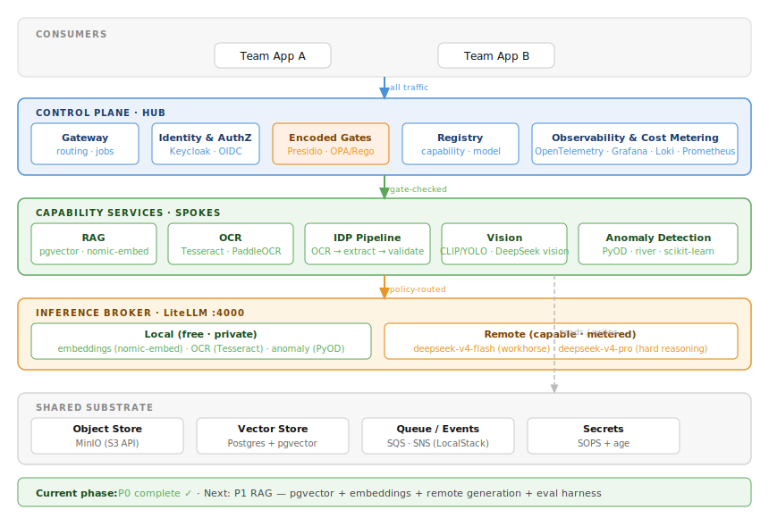
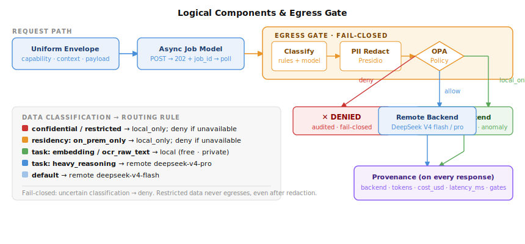

# AI Platform

A reference implementation of an enterprise AI platform: common capabilities (RAG, OCR, IDP, Vision, Anomaly Detection) exposed as composable services behind stable contracts, with AWS-shaped seams so the mental model transfers to a real deployment.

> Built on a 16 GB M4 Mac mini. Remote-first inference via DeepSeek V4. No paid API calls in tests.

---

## Architecture



**Every request flows:** client → gateway → encoded gates → spoke → broker → local or remote inference → provenance-stamped response.

---

## Logical Components



---

## Services (P0 running now)

| Service | Port | Role |
|---|---|---|
| `gateway` | 8000 | Control plane — envelope validation, async jobs, spoke routing |
| `capability-summarize` | 8001 | P0 stub spoke — proves the seam end-to-end |
| `litellm` | 4000 | Model broker — OpenAI-compatible proxy |
| `stub-backend` | 8002 | Mock provider — replays fixtures, no real API called |

---

## Quick Start

```bash
# Start the stack
docker compose up -d

# Unit tests (no docker required)
PYTHONPATH=. .venv/bin/pytest tests/test_envelope.py -v

# Integration tests
PYTHONPATH=. .venv/bin/pytest tests/test_p0_e2e.py -m integration -v

# Manual smoke test
curl -s -X POST http://localhost:8000/capabilities \
  -H "Content-Type: application/json" \
  -d '{"capability":"summarize","operation":"summarize",
       "context":{"tenant_id":"team-test","principal":"me"},
       "payload":{"text":"AI is transforming how enterprises build software."}}' \
  | python3 -m json.tool
```

---

## Build Phases

| Phase | Scope | Status |
|---|---|---|
| P0 | Walking skeleton — gateway · broker · stub provider · envelope | ✅ Done |
| P1 | RAG — pgvector · embeddings · remote generation · eval harness | ⬜ Next |
| P2 | OCR + IDP pipeline — Tesseract → extract → validate DAG | ⬜ |
| P3 | Vision + Anomaly detection | ⬜ |
| P4 | Security — egress gate · Presidio · OPA · audit log | ⬜ |

Full specification: [`AI-Platform-SPEC.md`](AI-Platform-SPEC.md)
