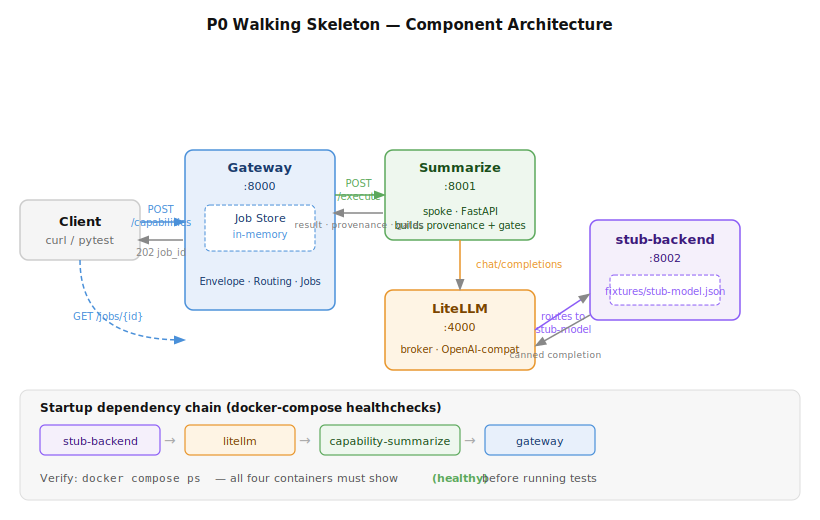
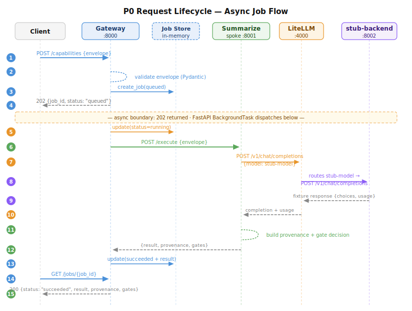

# ADR-016: P0 Walking Skeleton — Gateway + Spoke + Broker + Stub Provider

| | |
|---|---|
| **Status** | Accepted |
| **Date** | 2026-06-14 |
| **Phase** | P0 (complete) |

---

## Context

Before building any real capability, the platform needed a working end-to-end path that proved:

1. The uniform request/response envelope (spec §7) routes correctly through the hub-and-spoke topology.
2. The async job model (submit → 202 + job_id → poll) works.
3. Provenance is captured on every response — backend, tokens, cost, latency, confidence, gate decision.
4. The LiteLLM broker sits between spokes and inference backends so no capability ever calls a provider directly.
5. Tests can run without calling a paid API (record/replay stub provider, ADR-008).

P0 establishes this seam with a stub capability (`summarize`) and a mock provider. No real inference is called at any point.

---

## Decision

Four containers, each with a single responsibility:

| Service | Port | Role |
|---|---|---|
| `gateway` | 8000 | Control plane — validates envelope, creates jobs, dispatches to spokes, exposes `POST /capabilities` + `GET /jobs/{id}` |
| `capability-summarize` | 8001 | P0 stub spoke — implements the `summarize` capability, calls the LiteLLM broker, returns result + provenance + gate decision |
| `litellm` | 4000 | Model broker — OpenAI-compatible proxy, routes `stub-model` to the stub backend |
| `stub-backend` | 8002 | Mock provider — serves `fixtures/stub-model.json`; no real model is ever called |

---

## Component Architecture



> Startup dependency chain enforced by docker-compose `depends_on: condition: service_healthy`:
> `stub-backend healthy → litellm healthy → capability-summarize healthy → gateway starts`

---

## Request Lifecycle



**Key invariants:**
- Steps 1–4 always complete in < 5 ms — the 202 is immediate regardless of model latency.
- The spoke never calls a provider directly; it only talks to LiteLLM (step 7).
- Every completed job carries `provenance` and `gates` — these fields are never optional on a `succeeded` job.

---

## How to Confirm It Is Working

### 1 — Container health

```bash
docker compose ps
```

All four containers must show `(healthy)` before tests are meaningful.

Expected output:

```
NAME                             STATUS
platformai-gateway-1             Up (healthy)
platformai-capability-summarize-1  Up (healthy)
platformai-litellm-1             Up (healthy)
platformai-stub-backend-1        Up (healthy)
```

### 2 — Unit tests (no docker required)

Tests the envelope Pydantic models — unknown capabilities, invalid classifications, and required fields.

```bash
PYTHONPATH=. .venv/bin/pytest tests/test_envelope.py -v
```

Expected: **7 passed**

### 3 — Integration tests (stack must be up)

Tests the full async flow end-to-end, provenance completeness, and error paths.

```bash
PYTHONPATH=. .venv/bin/pytest tests/test_p0_e2e.py -m integration -v
```

Expected: **8 passed**

### 4 — Manual smoke test (curl)

```bash
# 1. Submit a job
RESPONSE=$(curl -s -X POST http://localhost:8000/capabilities \
  -H "Content-Type: application/json" \
  -d '{
    "capability": "summarize",
    "operation": "summarize",
    "context": {
      "tenant_id": "team-test",
      "principal": "me",
      "data_classification": "internal"
    },
    "payload": {
      "text": "Artificial intelligence is reshaping industries by enabling machines to learn from experience and make decisions with minimal human intervention."
    }
  }')

echo "Submit response: $RESPONSE"
JOB_ID=$(echo "$RESPONSE" | python3 -c "import sys,json; print(json.load(sys.stdin)['job_id'])")

# 2. Poll until done
sleep 1
curl -s http://localhost:8000/jobs/$JOB_ID | python3 -m json.tool
```

**Expected response shape:**

```jsonc
{
  "job_id": "<uuid>",
  "status": "succeeded",
  "capability": "summarize",
  "created_at": "...",
  "updated_at": "...",
  "result": {
    "summary": "This is a recorded stub response representing a model summary. ..."
  },
  "provenance": {
    "backend_used": "stub-model",
    "tokens_in": 55,
    "tokens_out": 23,
    "cost_usd": 0.0,
    "latency_ms": <int>,
    "confidence": 1.0
  },
  "gates": {
    "classification": "internal",
    "redactions_applied": 0,
    "egress_decision": "allowed"
  },
  "error": null
}
```

**What each field proves:**

| Field | What it confirms |
|---|---|
| `status: "succeeded"` | Async job lifecycle completed |
| `result.summary` | Spoke executed, broker routed, stub responded |
| `provenance.backend_used` | Broker identity is tracked on every response |
| `provenance.tokens_in / tokens_out` | Usage flows from stub → LiteLLM → spoke → gateway |
| `provenance.cost_usd` | Cost tracking hook is in place (0.0 for stub) |
| `provenance.latency_ms` | Wall-clock timing captured by spoke |
| `gates.egress_decision` | Gate decision is evaluated and recorded on every job |

### 5 — Confirm no real API was called

```bash
docker compose logs stub-backend | grep "POST /v1/chat/completions"
```

Every inference request must appear here. If a line appears in litellm logs that is *not* preceded by a matching stub-backend log entry, a real provider was contacted — that is a bug.

---

## Consequences

**Positive:**
- The gateway's spoke registry (`_ROUTES` in `gateway/main.py`) is the only change needed to add a new capability. The async job machinery, envelope validation, and provenance fields are already in place for P1–P4.
- The record/replay pattern is established. Add a new fixture file to `stub_backend/fixtures/<model>.json` for each model used in tests — no paid API calls in CI, ever.
- Startup dependency chain is encoded in docker-compose healthchecks. Services never boot against a broken dependency.

**Accepted limitations (to revisit in later phases):**

| Limitation | Planned resolution |
|---|---|
| Job store is in-memory — does not survive a gateway restart | Replace with Redis or Postgres-backed store in P2 |
| No authentication on the gateway | Wire Keycloak OIDC in P4 |
| Gate decision is a stub (`egress_decision: "allowed"` always) | Real OPA/Presidio egress gate in P4 |
| Tenancy is modelled (`tenant_id` in envelope) but not enforced | Deliberate — ADR-011; enforce in P3/P4 if needed |
| `cost_usd` is always 0.0 for stub responses | Will be real values when LiteLLM routes to a live provider |
