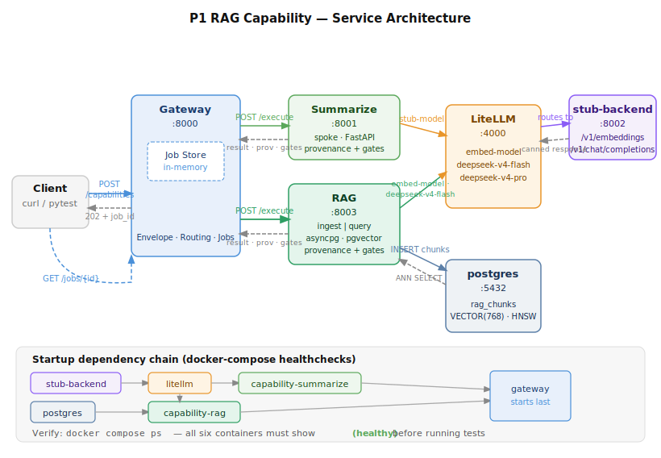
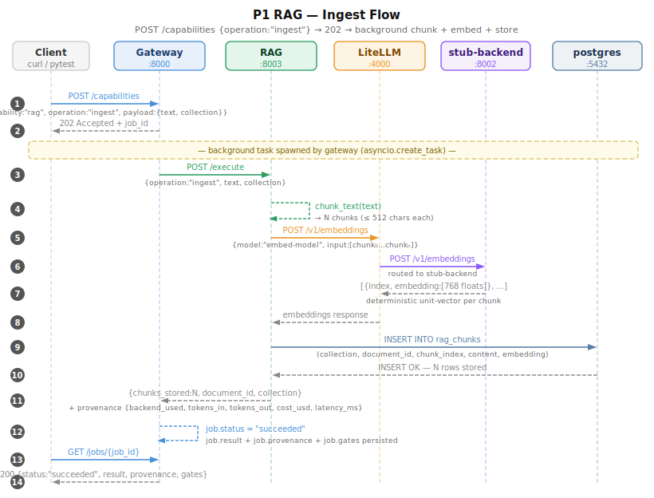
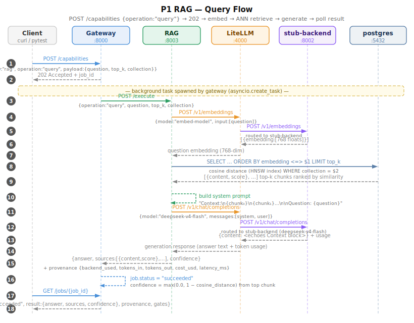
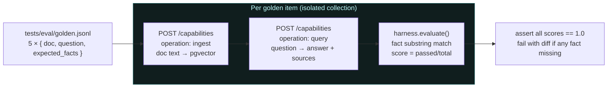
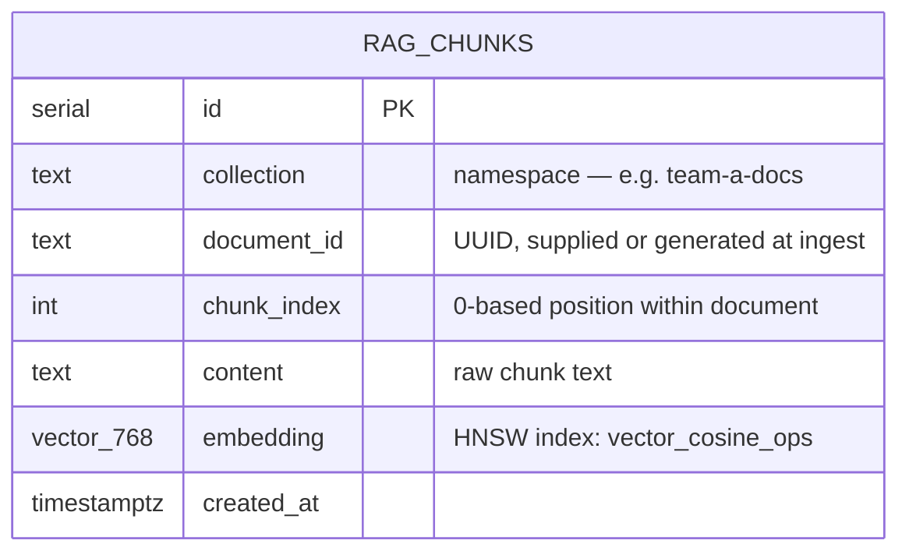

# ADR-017: P1 RAG Capability — pgvector + Embeddings + Remote Generation + Eval Harness

| | |
|---|---|
| **Status** | Accepted |
| **Date** | 2026-06-15 |
| **Phase** | P1 (complete) |

---

## Context

P0 proved the control-plane skeleton — envelope, async job model, broker routing, provenance on every response. P1 adds the platform's flagship spoke: **Retrieval-Augmented Generation (RAG)**.

RAG was chosen as the P1 flagship (ADR-012) for two reasons:

1. **RAM profile fits the 16 GB constraint.** Embeddings (~0.5 GB for `nomic-embed-text`) and Postgres stay resident; generation is fully remote. No local LLM RAM cost.
2. **Validates the hardest architectural seam.** RAG requires the broker to route to *two different backend types* (an embedding model and a generation model) in a single request — proving the broker abstraction generalises beyond a single model call.

### Decisions inherited from the spec and ADRs 011–015

| ADR | Decision binding on P1 |
|---|---|
| 008 | No paid API calls in tests — record/replay stub for all remote responses |
| 009 | Async by default — `POST /rag/query → 202 + job_id → GET /jobs/{id}` (ADR-015) |
| 010 | Broker-only inference — embeddings also route through LiteLLM, not directly to Ollama |
| 012 | RAG is the P1 flagship; pgvector is the vector store analog for Aurora pgvector / OpenSearch |
| 014 | Proper eval harness from P1 — rubric-based fact scoring, not golden-file snapshots |

---

## Decision

### New services

| Service | Port | Role |
|---|---|---|
| `postgres` (`pgvector/pgvector:pg16`) | 5432 | Vector store — single Postgres instance holding both relational and vector data; mirrors the Aurora pgvector AWS analog |
| `capability-rag` | 8003 | RAG spoke — implements `ingest` and `query` operations against pgvector + LiteLLM |

### New LiteLLM routes

| Model alias | Stub target | Production target |
|---|---|---|
| `embed-model` | stub-backend `/v1/embeddings` | `ollama/nomic-embed-text` at `http://ollama:11434` |
| `deepseek-v4-flash` | stub-backend `/v1/chat/completions` | DeepSeek API with real key |
| `deepseek-v4-pro` | stub-backend `/v1/chat/completions` | DeepSeek API with real key |

### Key design choices

**pgvector over Qdrant/Weaviate.** A single Postgres instance gives us both relational rows (job history, metadata) and vector search without a second infrastructure dependency. pgvector's HNSW index (`vector_cosine_ops`) is adequate for the document volumes expected in P1–P3. Qdrant would be the right call if we needed sub-millisecond ANN at millions of vectors; we do not.

**asyncpg + HNSW, not IVFFlat.** HNSW builds incrementally and tolerates an empty table at index-creation time. IVFFlat requires a two-phase build (insert data, then build clusters) which complicates the lifespan startup sequence. HNSW trades slightly more RAM for zero-friction schema bootstrapping.

**Bootstrap connection before pool.** `pgvector.asyncpg.register_vector` introspects the `public.vector` type at connection-open time. If the pool opens before `CREATE EXTENSION vector` runs, every connection fails. The fix: one pre-pool bootstrap `asyncpg.connect` call that creates the extension, then the pool opens with the codec already registered.

**Chunking strategy — paragraph-first, sentence-split fallback.** Double-newline paragraph boundaries are preserved when chunks fit within 512 characters. Long paragraphs are split at `. ` sentence boundaries. This is intentionally simple for P1; more sophisticated splitters (semantic, recursive, token-aware) belong to P3/P4 when document variety increases.

**Collection namespace.** Every chunk row carries a `collection` column. Callers pass `collection` in the payload — this is the seam for per-team or per-document-set isolation. There is no cross-collection search in P1.

**Confidence clamping.** pgvector cosine distance ∈ [0, 2], so `1 − distance` (cosine similarity) can be negative for near-orthogonal vectors. Confidence is clamped to `max(0.0, score)` before it enters the provenance envelope, which requires `confidence ∈ [0, 1]`.

**Stub embeddings — deterministic unit vectors.** The stub backend derives a 768-dim pseudo-random unit vector by seeding `random.Random` with `MD5(input_text)[:4]`. Vectors are unique per input and fully deterministic — the same text always returns the same embedding, making retrieval order reproducible in tests.

**Stub generation — context echo.** When the system prompt contains a `Context:` block (the RAG pattern), the stub extracts and returns the first 600 characters of that context as the answer. This lets the eval harness assert that ingested facts appear in the answer without any real model call.

**Per-item collection isolation in the eval.** Because stub embeddings are not semantic, a shared collection with multiple documents produces arbitrary retrieval ordering. Each golden-set item is ingested into its own ephemeral collection, guaranteeing the retrieval step always returns the one correct document. This is a test-environment constraint only; in production, a single collection with real semantic embeddings works as expected.

---

## Logical Architecture



> Startup dependency chain enforced by docker-compose `depends_on: condition: service_healthy`:
> `stub-backend` and `postgres` healthy → `litellm` healthy → `capability-rag` and `capability-summarize` healthy → `gateway` starts

---

## Ingest Flow



**Key invariants:**
- Steps 1–2 always complete in < 5 ms — the 202 is immediate regardless of embedding latency.
- Chunking (step 4) runs entirely in-process; no model call until step 5.
- Every ingested chunk carries both raw text and the 768-dim embedding vector in a single row.

---

## Query Flow



**Key invariants:**
- LiteLLM is called twice per query: once for embedding (step 4) and once for generation (step 11). Both route through the broker — no direct provider calls.
- The system prompt fed to the generation model always contains the raw retrieved chunks. The stub echoes this context back, making the eval harness deterministic without a real model.
- `confidence` in provenance is `max(0.0, 1 − cosine_distance)` from the top-ranked chunk (step 16).

---

## Eval Harness

The eval harness follows the pattern mandated by ADR-014: rubric-based scoring over a golden set, with deterministic (cached/stubbed) model responses so CI results are repeatable.



**Scoring:** each `expected_fact` string is checked for case-insensitive substring presence in the answer. A case scores `1.0` only if every fact is found. The test asserts all five golden cases score `1.0`.

**Why per-item isolation?** Stub embeddings are non-semantic (seeded from MD5, not trained). A shared collection with N documents produces arbitrary ANN ordering. Isolating each case to its own collection guarantees retrieval returns the one correct document. Production deployments with real semantic embeddings do not need this constraint.

---

## Schema



The `(collection, document_id)` pair is the idempotency key: re-ingesting the same `document_id` into the same `collection` deletes all existing chunks for that pair before inserting new ones.

---

## How to Confirm It Is Working

### 1 — Container health

```bash
docker compose ps
```

All six containers must show `(healthy)`:

```
NAME                              STATUS
platformai-gateway-1              Up (healthy)
platformai-capability-rag-1       Up (healthy)
platformai-capability-summarize-1 Up (healthy)
platformai-litellm-1              Up (healthy)
platformai-stub-backend-1         Up (healthy)
platformai-postgres-1             Up (healthy)
```

### 2 — Unit tests (no docker required)

Tests chunking logic, eval rubric scorer, and stub embedding properties.

```bash
.venv/bin/pytest tests/test_p1_rag_unit.py tests/test_envelope.py -v
```

Expected: **22 passed**

### 3 — Integration tests (stack must be up)

Tests the full ingest → query lifecycle end-to-end, including provenance completeness, idempotent ingest, empty-collection resilience, and error paths.

```bash
.venv/bin/pytest tests/test_p1_rag_e2e.py -m integration -v
```

Expected: **9 passed**

### 4 — Eval harness (stack must be up)

Runs all five golden Q&A cases through the live stack and asserts every expected fact appears in the answer.

```bash
.venv/bin/pytest tests/test_p1_eval.py -m integration -v
```

Expected: **1 passed** (covers all five golden cases internally)

### 5 — Full suite

```bash
.venv/bin/pytest tests/ -v
```

Expected: **40 passed**

### 6 — Manual smoke test (curl)

```bash
# 1. Ingest a document
INGEST=$(curl -s -X POST http://localhost:8000/capabilities \
  -H "Content-Type: application/json" \
  -d '{
    "capability": "rag",
    "operation": "ingest",
    "context": { "tenant_id": "team-demo", "principal": "me", "data_classification": "internal" },
    "payload": {
      "collection": "demo",
      "text": "The Andes is the longest continental mountain range in the world, stretching 7,000 km along the western edge of South America."
    }
  }')

echo "Ingest: $INGEST"
INGEST_JOB=$(echo "$INGEST" | python3 -c "import sys,json; print(json.load(sys.stdin)['job_id'])")
sleep 1
curl -s http://localhost:8000/jobs/$INGEST_JOB | python3 -m json.tool

# 2. Query
QUERY=$(curl -s -X POST http://localhost:8000/capabilities \
  -H "Content-Type: application/json" \
  -d '{
    "capability": "rag",
    "operation": "query",
    "context": { "tenant_id": "team-demo", "principal": "me", "data_classification": "internal" },
    "payload": { "collection": "demo", "question": "How long is the Andes mountain range?", "top_k": 3 }
  }')

QUERY_JOB=$(echo "$QUERY" | python3 -c "import sys,json; print(json.load(sys.stdin)['job_id'])")
sleep 1
curl -s http://localhost:8000/jobs/$QUERY_JOB | python3 -m json.tool
```

**Expected query job shape:**

```jsonc
{
  "job_id": "<uuid>",
  "status": "succeeded",
  "capability": "rag",
  "result": {
    "answer": "...",          // contains the ingested fact
    "sources": [
      { "content": "The Andes is the longest...", "score": 0.87 }
    ]
  },
  "provenance": {
    "backend_used": "deepseek-v4-flash",
    "tokens_in": 142,
    "tokens_out": 38,
    "cost_usd": 0.0,          // 0.0 while using stub; real value with live provider
    "latency_ms": 23,
    "confidence": 0.87        // cosine similarity of top retrieved chunk; clamped ≥ 0
  },
  "gates": {
    "classification": "internal",
    "redactions_applied": 0,
    "egress_decision": "allowed"
  }
}
```

**What each field proves:**

| Field | What it confirms |
|---|---|
| `result.answer` | Retrieval + generation pipeline executed end-to-end |
| `result.sources[].content` | pgvector ANN search returned the ingested chunk |
| `result.sources[].score` | Cosine similarity is computed and surfaced per source |
| `provenance.backend_used` | Generation model identity tracked on every response |
| `provenance.tokens_in` | Usage flows from stub → LiteLLM → spoke (includes context tokens) |
| `provenance.confidence` | Top-1 retrieval score; clamped to [0, 1] |
| `gates.egress_decision` | Gate evaluation recorded (stub always `"allowed"` — full gate in P4) |

---

## Consequences

**Positive:**

- The broker-only rule is now proven across two different backend types (embedding + generation) in a single request path.
- pgvector's HNSW index is in place; the retrieval seam is ready for real semantic embeddings (`nomic-embed-text` via Ollama) by swapping the LiteLLM config — no code changes.
- The collection namespace is the seam for per-team isolation. Multi-collection support requires no schema changes, only routing logic in callers.
- The eval harness pattern (rubric scorer + golden JSONL + pytest integration test) is established and can be copied for IDP (P2), Vision, and Anomaly (P3).

**Accepted limitations (to revisit in later phases):**

| Limitation | Planned resolution |
|---|---|
| Ingest accepts `payload.text` directly — no `object_ref` / MinIO path | `object_ref` support in P2 when MinIO is added |
| No chunking metadata (start offset, source URL, page number) | Add to schema when IDP documents need provenance back to source |
| IVFFlat not used — HNSW at P1 scale is fine but higher RAM per vector | Revisit if collection sizes exceed ~500 k chunks |
| Gate decision is still a stub (`"allowed"` always) | Real Presidio + OPA egress gate in P4 |
| `cost_usd` is 0.0 for stub responses | Real values when LiteLLM routes to live DeepSeek provider |
| `reindex` operation (re-embed existing collection with new model) is not implemented | Add in P3 if embedding model is upgraded |
| No document-level deduplication — same text ingested twice creates a new `document_id` each time unless the caller supplies one | Callers should supply stable `document_id` values for idempotent ingest |
