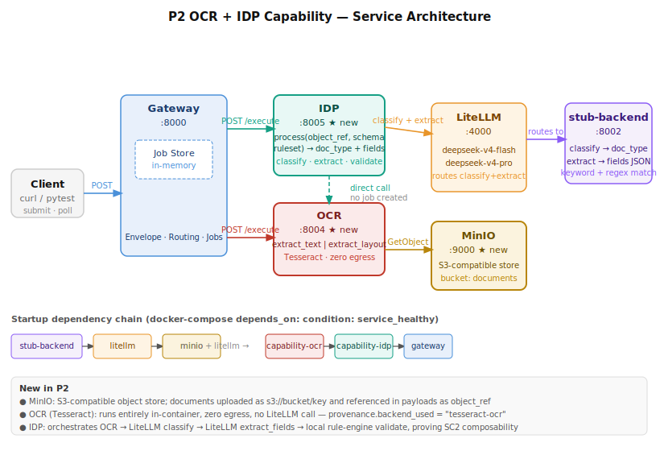
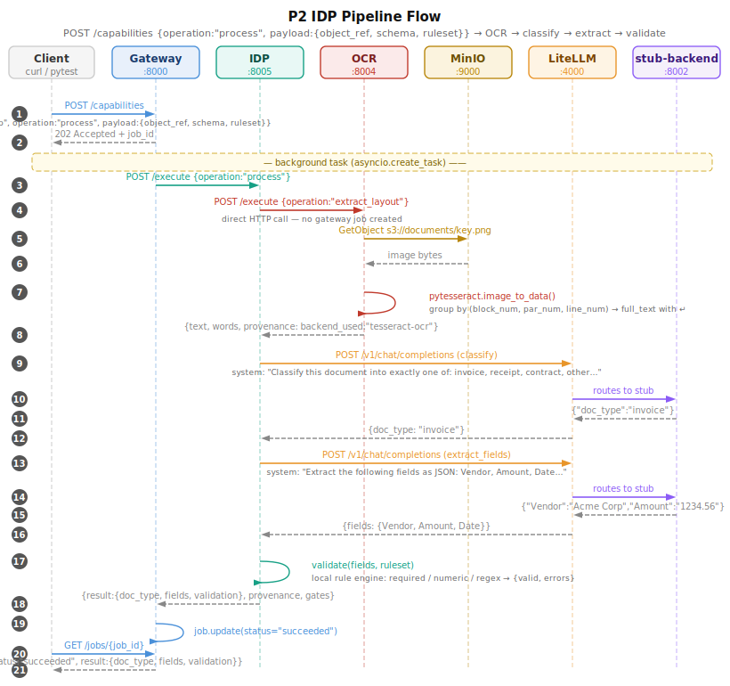

# ADR-018 — P2: OCR + IDP Capability

**Date:** 2026-06-20
**Status:** Accepted
**Phase:** P2
**Deciders:** Dane Balia

---

## Context

P2 extends the platform with document-intelligence capabilities. Two new spokes are added:

- **OCR** (`capability-ocr`, :8004) — converts scanned images to machine-readable text using Tesseract. Runs fully in-container; no LiteLLM call, no egress.
- **IDP** (`capability-idp`, :8005) — Intelligent Document Processing pipeline that orchestrates OCR → classify → extract → validate to turn unstructured documents into structured JSON.

Documents are stored in **MinIO** (S3-compatible object store, :9000) and referenced in request payloads as `s3://bucket/key`. This is the first phase to require an object store, proving the platform can handle binary payloads without coupling the gateway to object management.

The IDP pipeline exercises the hub-and-spoke composability requirement from the spec: one spoke (IDP) calls another (OCR) directly for a synchronous sub-operation, without routing through the gateway and creating a nested job.

---

## Decision

### Services

| Service | Port | Description |
|---|---|---|
| `capability-ocr` | 8004 | Tesseract OCR; `extract_text` and `extract_layout` operations |
| `capability-idp` | 8005 | IDP pipeline; `process` operation → doc_type + fields + validation |
| `minio` | 9000 | S3-compatible object store; bucket `documents` |

### Key design choices

| Concern | Decision |
|---|---|
| OCR engine | Tesseract via `pytesseract`; no cloud OCR API, no egress, `backend_used="tesseract-ocr"` |
| IDP→OCR call | Direct HTTP (`httpx`) from IDP to OCR's `/execute` endpoint; no gateway job created for the sub-call |
| LiteLLM usage | IDP calls LiteLLM twice per document: once for `classify` (→ doc_type), once for `extract_fields` (→ field JSON) |
| Model selection | `deepseek-v4-flash` for both classify and extract (workhorse; pro is reserved for hard reasoning) |
| Validation | Local rule engine inside IDP; evaluates `required`, `numeric`, `regex` rules from the `ruleset` payload field |
| Stub dispatch | `stub-backend` identifies classify calls by `"Classify this document into exactly one of:"` in the system prompt; extract calls by `"Extract the following fields as JSON:"` — keyword matching, no model invocation |
| Object reference | `object_ref` field in payload carries the `s3://bucket/key` URI; OCR resolves it with `boto3` using `MINIO_ENDPOINT` env var |
| Async pattern | Gateway creates a job, dispatches `asyncio.create_task` to IDP `/execute`; IDP→OCR call is sync within that task |
| Provenance | Every response includes `backend_used`, `tokens_in`, `tokens_out`, `cost_usd`, `latency_ms`, `confidence`, `gates`; OCR sets `tokens_in/out=0`, `cost_usd=0.0` |

### Startup dependency chain

```
stub-backend → litellm
minio ──────────────────→ capability-ocr → capability-idp → gateway
litellm ────────────────↗
```

All `depends_on` use `condition: service_healthy`.

---

## Architecture



---

## Flow



**Summary of the 21-step IDP flow:**

1. Client `POST /capabilities` with `capability:"idp"`, `operation:"process"`, `payload:{object_ref, schema, ruleset}`
2. Gateway returns `202 Accepted + job_id`
3. Background task: Gateway calls IDP `/execute`
4. IDP calls OCR `/execute` directly (no job created)
5. OCR calls MinIO `GetObject` for the image bytes
6. MinIO returns raw bytes
7. OCR runs `pytesseract.image_to_data()` grouped by block/par/line → full text
8. OCR returns `{text, words, provenance}`
9. IDP calls LiteLLM `/v1/chat/completions` (classify prompt)
10. LiteLLM routes to stub-backend
11. Stub returns `{"doc_type":"invoice"}`
12. LiteLLM returns classify result to IDP
13. IDP calls LiteLLM `/v1/chat/completions` (extract_fields prompt)
14. LiteLLM routes to stub-backend
15. Stub returns field JSON
16. LiteLLM returns extract result to IDP
17. IDP runs local `validate(fields, ruleset)` → `{valid, errors}`
18. IDP returns full result to Gateway
19. Gateway marks job `succeeded`
20. Client `GET /jobs/{job_id}` (polls)
21. Gateway returns `200 {status:"succeeded", result:{doc_type, fields, validation}}`

---

## How to Confirm It Is Working

### 1. Service health

```bash
# all 8 services healthy
docker-compose ps
# capability-ocr and capability-idp should show "healthy"
curl -s http://localhost:8004/health | python3 -m json.tool
curl -s http://localhost:8005/health | python3 -m json.tool
curl -s http://localhost:9000/minio/health/live  # 200 OK
```

### 2. Unit tests (no docker required)

```bash
# 22 P2 unit tests — OCR and IDP tested via FastAPI TestClient
pytest tests/test_p2_idp_unit.py -v
# Expected: 15 passed

# Full unit suite (62 tests after P2)
pytest tests/ -v -k "not e2e"
```

### 3. Integration / e2e tests

```bash
# Start the stack first
docker-compose up -d --build

# Run P2 integration tests (requires running stack)
pytest tests/test_p2_idp_e2e.py -v
# Expected: 7 passed

# Full suite (all 62 tests, P0 + P1 + P2)
pytest tests/ -v
```

### 4. Manual smoke test — happy path

```bash
# Upload a test image to MinIO
docker run --rm --network platformai_default \
  -e AWS_ACCESS_KEY_ID=platform \
  -e AWS_SECRET_ACCESS_KEY=platform123 \
  amazon/aws-cli --endpoint-url http://minio:9000 \
  s3 cp /dev/stdin s3://documents/test.png --content-type image/png <<< "$(python3 -c "
from PIL import Image, ImageDraw, ImageFont; import io, base64
img = Image.new('RGB',(400,120),color='white')
draw = ImageDraw.Draw(img)
draw.text((10,10),'Invoice #001\nVendor: Acme Corp\nAmount: 1234.56\nDate: 2026-06-20',fill='black')
buf = io.BytesIO(); img.save(buf,'PNG'); print(base64.b64encode(buf.getvalue()).decode())
" | base64 -d)"

# Submit IDP process job
JOB=$(curl -s -X POST http://localhost:8000/capabilities \
  -H 'Content-Type: application/json' \
  -d '{
    "tenant_id": "t1",
    "capability": "idp",
    "operation": "process",
    "payload": {
      "object_ref": "s3://documents/test.png",
      "schema": {"Vendor": "string", "Amount": "number", "Date": "string"},
      "ruleset": [{"field": "Vendor", "rule": "required"}, {"field": "Amount", "rule": "numeric"}]
    }
  }' | python3 -c "import sys,json; print(json.load(sys.stdin)['job_id'])")

echo "Job ID: $JOB"

# Poll until succeeded
sleep 2
curl -s http://localhost:8000/jobs/$JOB | python3 -m json.tool
# Expect: status="succeeded", result.doc_type="invoice", result.fields={...}, result.validation.valid=true
```

### 5. Error / denial path

```bash
# Submit with a missing required field in a ruleset that can't be satisfied
curl -s -X POST http://localhost:8000/capabilities \
  -H 'Content-Type: application/json' \
  -d '{
    "tenant_id": "t1",
    "capability": "idp",
    "operation": "process",
    "payload": {
      "object_ref": "s3://documents/test.png",
      "schema": {"PO_Number": "string"},
      "ruleset": [{"field": "PO_Number", "rule": "required"}]
    }
  }'
# Job should succeed structurally but result.validation.valid=false, errors=["PO_Number is required"]
```

---

## Consequences

**Positive:**
- Documents can be processed end-to-end with no cloud egress for OCR — Tesseract runs in the container.
- IDP demonstrates spoke-to-spoke composability without gateway mediation.
- MinIO S3 API means the object-store contract is cloud-portable (swap MinIO → real S3 in P5 with zero code change).
- Stub dispatch pattern (keyword-matched system prompts) keeps CI fast with no paid API calls.

**Negative / watch-outs:**
- IDP→OCR is a direct HTTP call, not queued. If OCR is slow (large image, many words) the IDP background task blocks. Acceptable at this scale; would need a queue for production workloads.
- Tesseract accuracy depends on image quality. The platform does not pre-process images (deskew, denoise). This is intentional — P2 scopes to the pipeline architecture, not OCR accuracy tuning.
- MinIO data is ephemeral (no persistent volume in docker-compose). A `docker-compose down` destroys all uploaded documents. Add a named volume when persistence is needed.
- IsolationForest models (P3) and OCR both run in-process. If co-deployed they are both "hot" simultaneously, but neither is a large LLM — the one-local-model rule targets models ≥ 500 MB.
