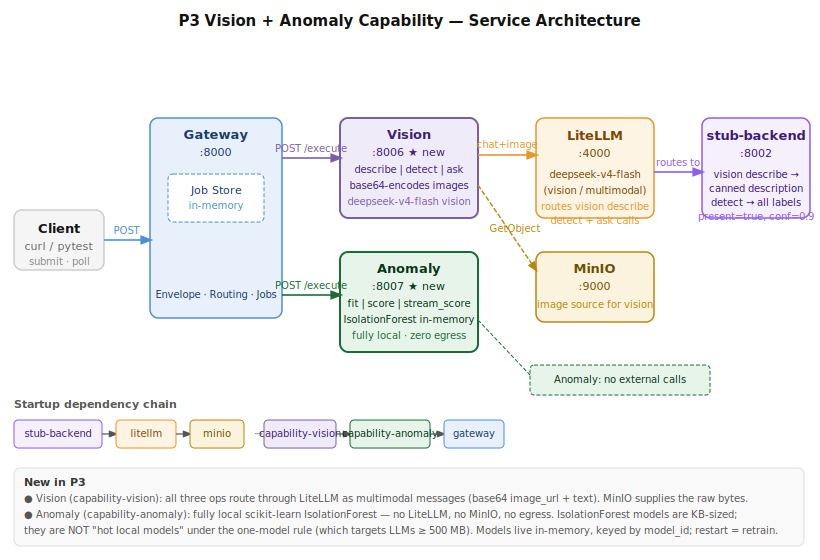
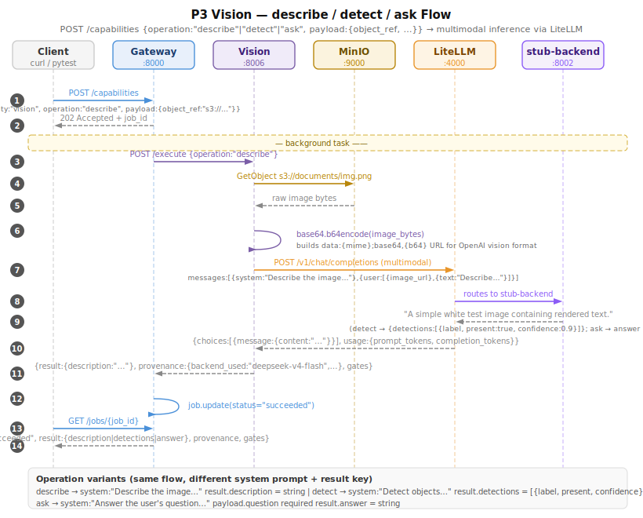
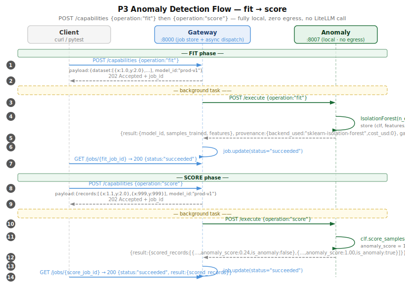

# ADR-019 — P3: Vision + Anomaly Detection Capability

**Date:** 2026-06-20
**Status:** Accepted
**Phase:** P3
**Deciders:** Dane Balia

---

## Context

P3 adds two more spokes that test two distinct inference patterns:

- **Vision** (`capability-vision`, :8006) — multimodal image understanding via LiteLLM. Images are fetched from MinIO, base64-encoded, and sent as OpenAI-format `image_url` content parts. Supports `describe`, `detect`, and `ask` operations.
- **Anomaly** (`capability-anomaly`, :8007) — tabular anomaly detection using scikit-learn `IsolationForest`. Runs fully local with no LiteLLM call, no MinIO access, and no egress of any kind. Supports `fit`, `score`, and `stream_score` operations.

Together they complete the four capability spokes (summarize, RAG, IDP/OCR, vision, anomaly) that form the P0→P3 hub-and-spoke skeleton.

P3 also validates two architectural rules from the spec:

1. **Broker-only inference** — vision routes all model calls through LiteLLM even for multimodal requests; no direct provider API call.
2. **One local model hot at a time** — `IsolationForest` models are KB-sized in-memory objects (not LLMs ≥ 500 MB), so they do not count against the local-model budget and may coexist with the rest of the stack.

---

## Decision

### Services

| Service | Port | Description |
|---|---|---|
| `capability-vision` | 8006 | Multimodal image ops; uses LiteLLM + MinIO |
| `capability-anomaly` | 8007 | Tabular anomaly detection; fully local, no external calls |

### Key design choices

| Concern | Decision |
|---|---|
| Vision image loading | `boto3` S3 client downloads from MinIO; bytes are base64-encoded in-process before calling LiteLLM |
| Multimodal message format | OpenAI vision format: `content: [{type:"image_url", image_url:{url:"data:{mime};base64,{b64}"}}, {type:"text", text:"…"}]` |
| Vision model | `deepseek-v4-flash` (workhorse) via LiteLLM; `GEN_MODEL` env var |
| Vision operations | `describe` — canned system prompt; `detect` — returns `{detections:[{label,present,confidence}]}` parsed from JSON response; `ask` — passes `payload.question` as user text |
| Stub dispatch for vision | `stub-backend` identifies vision calls by system-prompt prefix: `"Describe the image"` → description string; `"Detect objects"` → detections JSON; `"Answer the user's question about the image"` → answer string |
| Anomaly engine | `sklearn.ensemble.IsolationForest(n_estimators=100, contamination="auto", random_state=42)` |
| Model persistence | `_models` dict in-process, keyed by `model_id`; restart = retrain. Intentional at this scale. |
| Anomaly scoring | `clf.score_samples(X)` returns negative scores (lower = more anomalous). Normalized to `[0,1]` via training bounds: `anomaly_score = 1 − (s − s_min) / (s_max − s_min + 1e-9)`. Bounds stored at fit time. |
| Anomaly `is_anomaly` | `clf.predict(X) == -1`; with `contamination="auto"` (~0.1), approximately 10% of training records are predicted as anomalous — tests must not assert `is_anomaly=False` for training-set records |
| Stub for multimodal content | `_Message.content: str | list[Any]` with `.text()` method that extracts text parts; all existing IDP/RAG stubs updated to use `.text()` |
| Async pattern | Same as all spokes: Gateway job → `asyncio.create_task` → capability `/execute` → result stored in job |

### Startup dependency chain

```
stub-backend → litellm → minio → capability-vision → capability-anomaly → gateway
```

All `depends_on` use `condition: service_healthy`. `capability-anomaly` has no external deps but is in the chain to guarantee gateway starts last.

---

## Architecture



---

## Vision Flow



**Summary (14 steps):**

1. Client `POST /capabilities` with `capability:"vision"`, `operation:"describe"` (or `"detect"` / `"ask"`)
2. Gateway returns `202 Accepted + job_id`
3. Background task: Gateway calls Vision `/execute`
4. Vision calls MinIO `GetObject` for image bytes
5. MinIO returns raw bytes
6. Vision `base64.b64encode(bytes)` and constructs `data:{mime};base64,…` URL
7. Vision calls LiteLLM `/v1/chat/completions` with multimodal messages
8. LiteLLM routes to stub-backend
9. Stub returns canned response (description / detections JSON / answer)
10. LiteLLM returns OpenAI-format response to Vision
11. Vision returns `{result, provenance, gates}` to Gateway
12. Gateway marks job `succeeded`
13. Client `GET /jobs/{job_id}` (polls)
14. Gateway returns `200 {status:"succeeded", result:{description|detections|answer}, provenance, gates}`

---

## Anomaly Flow



**Summary (14 steps across two operations):**

**FIT (steps 1–7):**
1. Client `POST /capabilities` with `operation:"fit"`, `payload:{dataset:[{x:1.0,y:2.0},…], model_id:"prod-v1"}`
2. Gateway returns `202 Accepted + job_id`
3. Background task: Gateway calls Anomaly `/execute`
4. Anomaly trains `IsolationForest`, stores `(clf, features, train_score_min, train_score_max)` in `_models["prod-v1"]`
5. Anomaly returns `{result:{model_id, samples_trained, features}, provenance:{cost_usd:0,backend_used:"sklearn-isolation-forest"}, gates}`
6. Gateway marks job `succeeded`
7. Client polls → `{status:"succeeded"}`

**SCORE (steps 8–14):**
8. Client `POST /capabilities` with `operation:"score"`, `payload:{records:[…], model_id:"prod-v1"}`
9. Gateway returns `202 Accepted + job_id`
10. Background task: Gateway calls Anomaly `/execute`
11. Anomaly runs `clf.score_samples(X)`, normalizes each score, runs `clf.predict(X)` for `is_anomaly` flag
12. Anomaly returns `{result:{scored_records:[{…, anomaly_score:float, is_anomaly:bool}]}, provenance, gates}`
13. Gateway marks job `succeeded`
14. Client polls → `{status:"succeeded", result:{scored_records}}`

---

## How to Confirm It Is Working

### 1. Service health

```bash
docker-compose ps
# capability-vision and capability-anomaly should show "healthy"
curl -s http://localhost:8006/health | python3 -m json.tool
curl -s http://localhost:8007/health | python3 -m json.tool
```

### 2. Unit tests (no docker required)

```bash
# 15 anomaly unit tests — IsolationForest logic, normalization, feature enforcement
pytest tests/test_p3_anomaly_unit.py -v

# Full unit suite (no e2e)
pytest tests/ -v -k "not e2e"
```

### 3. Integration / e2e tests

```bash
# Start the stack first
docker-compose up -d --build

# P3 integration tests (vision + anomaly, 9 tests)
pytest tests/test_p3_e2e.py -v

# Full suite (85 tests: P0 + P1 + P2 + P3)
pytest tests/ -v
# Expected: 85 passed
```

### 4. Manual smoke test — vision describe

```bash
# Upload a test PNG to MinIO first (or reuse one from P2 testing)
# Then submit a describe job:
JOB=$(curl -s -X POST http://localhost:8000/capabilities \
  -H 'Content-Type: application/json' \
  -d '{
    "tenant_id": "t1",
    "capability": "vision",
    "operation": "describe",
    "payload": {"object_ref": "s3://documents/test.png"}
  }' | python3 -c "import sys,json; print(json.load(sys.stdin)['job_id'])")

sleep 2
curl -s http://localhost:8000/jobs/$JOB | python3 -m json.tool
# Expect: status="succeeded", result.description="A simple white test image…"
# Expect: provenance.backend_used="deepseek-v4-flash", provenance.cost_usd > 0
```

### 5. Manual smoke test — vision detect

```bash
JOB=$(curl -s -X POST http://localhost:8000/capabilities \
  -H 'Content-Type: application/json' \
  -d '{
    "tenant_id": "t1",
    "capability": "vision",
    "operation": "detect",
    "payload": {
      "object_ref": "s3://documents/test.png",
      "labels": ["invoice", "text", "table"]
    }
  }' | python3 -c "import sys,json; print(json.load(sys.stdin)['job_id'])")

sleep 2
curl -s http://localhost:8000/jobs/$JOB | python3 -m json.tool
# Expect: result.detections=[{label:"invoice",present:true,confidence:0.9}, …]
```

### 6. Manual smoke test — anomaly fit + score

```bash
# Fit a model on synthetic normal data
FIT_JOB=$(curl -s -X POST http://localhost:8000/capabilities \
  -H 'Content-Type: application/json' \
  -d '{
    "tenant_id": "t1",
    "capability": "anomaly",
    "operation": "fit",
    "payload": {
      "model_id": "smoke-test",
      "dataset": '"$(python3 -c "import json; print(json.dumps([{'x': float(i), 'y': float(i*0.5)} for i in range(80)]))")'
    }
  }' | python3 -c "import sys,json; print(json.load(sys.stdin)['job_id'])")

sleep 2
curl -s http://localhost:8000/jobs/$FIT_JOB | python3 -m json.tool
# Expect: status="succeeded", result.samples_trained=80

# Score a normal record and an outlier
SCORE_JOB=$(curl -s -X POST http://localhost:8000/capabilities \
  -H 'Content-Type: application/json' \
  -d '{
    "tenant_id": "t1",
    "capability": "anomaly",
    "operation": "score",
    "payload": {
      "model_id": "smoke-test",
      "records": [{"x": 1.1, "y": 0.55}, {"x": 9999.0, "y": 9999.0}]
    }
  }' | python3 -c "import sys,json; print(json.load(sys.stdin)['job_id'])")

sleep 2
curl -s http://localhost:8000/jobs/$SCORE_JOB | python3 -m json.tool
# Expect: first record anomaly_score < 0.5, second record is_anomaly=true, anomaly_score > 0.9
# Expect: provenance.backend_used="sklearn-isolation-forest", provenance.cost_usd=0.0
# Expect: gates.egress_decision="allowed"
```

### 7. Verify zero egress (anomaly)

```bash
# The anomaly service has no LITELLM_URL or MINIO_ENDPOINT environment variables.
# Confirm no outbound calls by checking docker-compose.yml anomaly service definition:
grep -A 20 'capability-anomaly:' docker-compose.yml
# Should show: no LITELLM_URL env, no depends_on litellm or minio

# Also confirm cost_usd=0 in every anomaly response:
curl -s http://localhost:8000/jobs/$SCORE_JOB | python3 -c \
  "import sys,json; d=json.load(sys.stdin); print('cost_usd:', d['provenance']['cost_usd'])"
# Expected: cost_usd: 0.0
```

---

## Consequences

**Positive:**
- Vision proves LiteLLM handles multimodal (image_url) payloads correctly through the broker-only inference path — no direct provider calls.
- Anomaly proves the platform can host a fully local, zero-egress ML capability alongside remote capabilities in the same gateway.
- `IsolationForest` with `contamination="auto"` is a sound default for unsupervised anomaly detection when the normal-data fraction is unknown.
- Score normalization via stored training bounds makes `anomaly_score` comparable across calls without re-fitting.
- Stub-backend's `_Message.content: str | list[Any]` change is backward-compatible: all existing text-only prompts continue to work unchanged.

**Negative / watch-outs:**
- `IsolationForest` models are in-process memory only; a container restart loses all trained models. Production use requires serializing models to storage (e.g. `joblib.dump` → MinIO).
- `contamination="auto"` flags ~10% of training records as anomalous by design. Tests must not assert `is_anomaly=False` for specific training records — only assert that extreme outliers (10× outside the training range) are flagged.
- Vision requires an image already present in MinIO. Tests create the image programmatically (Pillow); manual smoke tests require an upload step first.
- The `detect` operation relies on LiteLLM (and the underlying model) returning valid JSON `{"detections":[…]}`. Vision falls back to `[]` if JSON parsing fails, rather than raising — acceptable for P3, should be surfaced as a warning in P4 observability.
- At 85 tests total, the full suite remains fast (under 30 s) because all model calls hit the stub. No paid API calls, no network latency.
