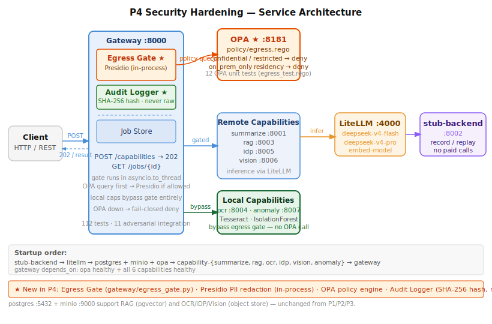
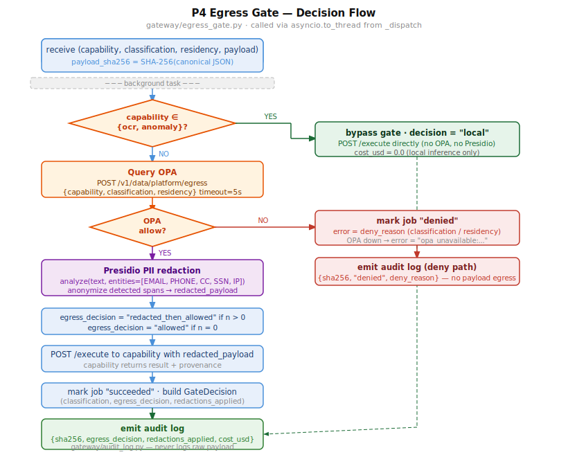

# ADR-020 — P4 Security Hardening: Egress Gate, OPA, Presidio, Audit Log

**Status:** Accepted  
**Phase:** P4  
**Date:** 2026-06-21

---

## Context

P0–P3 built the capability spokes and the async job lifecycle but left the gateway's dispatch path open: any request with any data classification could reach any remote provider. P4 closes that gap with a fail-closed egress gate that runs before every capability dispatch.

Requirements from `CLAUDE.md`:

- `confidential` and `restricted` data **never** egresses to a remote provider, regardless of redaction confidence.
- PII redaction via **Presidio** must run before any remote egress — no exceptions.
- Log hashes and classification labels only. Never log raw payloads, even at debug level.
- Policy-as-code: **OPA/Rego** is the source of truth for egress decisions.

---

## Decision

### Services added / modified

| Component | Where | Role |
|---|---|---|
| `opa` | new Docker service `:8181` | Policy engine; evaluates `policy/egress.rego` |
| `gateway/egress_gate.py` | new module | OPA query + Presidio redaction; returns `(decision, redacted_payload, n, deny_reason)` |
| `gateway/audit_log.py` | new module | Structured JSON audit record; SHA-256 hash of payload, never raw content |
| `gateway/main.py` | modified `_dispatch` | Calls egress gate via `asyncio.to_thread`; constructs `GateDecision`; emits audit on all paths |
| `policy/egress.rego` | new | Rego rules: deny confidential/restricted to remote; deny `on_prem_only` residency; local caps always allow |
| `policy/egress_test.rego` | new | 12 OPA unit tests covering all rule branches |

### Key design choices

**OPA before Presidio.** The gate queries OPA first (fast, cheap network call), then runs Presidio only if OPA allows. No point redacting a payload that will be denied anyway.

**Presidio runs in-process, not as a service.** Calling a separate Presidio container per-request adds a round-trip and a new failure mode. Running it in the gateway process via `asyncio.to_thread` keeps the gate atomic and eliminates a dependency edge.

**Five high-precision PII entity types only.** Presidio's default entity set causes false positives on structured API payloads — `US_DRIVER_LICENSE` matches `s3://` URI prefixes, `ORGANIZATION` matches acronyms like "RAG". The gate uses only: `EMAIL_ADDRESS`, `PHONE_NUMBER`, `CREDIT_CARD`, `US_SSN`, `IP_ADDRESS`. These are pattern-based with very low false-positive rates.

**Fail-closed on OPA unavailability.** If the OPA HTTP call raises any exception, `_query_opa` returns `(False, "opa_unavailable:...")`. The job is denied. There is no fallback to a permissive mode.

**Local capabilities (`ocr`, `anomaly`) bypass the gate entirely.** These services run on-premises (Tesseract, IsolationForest) and make no external inference calls. They skip OPA, Presidio, and the `_LOCAL` check short-circuits before any gate work begins.

**Gateway is authoritative for `GateDecision`.** Prior to P4 the capability services returned `gates` in their own response. From P4 the gateway constructs `GateDecision` itself from the egress gate result, so capabilities cannot misreport their own egress behaviour.

**Audit records contain only the SHA-256 hash of the canonical JSON payload.** `audit_log.hash_payload()` serialises with `sort_keys=True` then SHA-256 encodes. The hash identifies the payload for correlation without storing any content. `audit_log.emit()` never accepts the raw payload.

---

## Architecture



Key points visible in the diagram:

- **Egress Gate** and **Audit Logger** are sub-components inside the Gateway box — they are modules, not services.
- **OPA** is a separate service; the gate queries it over HTTP from within `asyncio.to_thread`.
- **Remote Capabilities** (summarize, rag, idp, vision) sit behind the gate; **Local Capabilities** (ocr, anomaly) have a direct path from the gateway that bypasses the gate entirely.
- Startup order: `stub-backend → litellm → [postgres · minio · opa] → capabilities (×6) → gateway`. The gateway `depends_on` OPA being healthy before it accepts traffic.

---

## Egress Gate Flow



### Step-by-step

1. `_dispatch` receives the capability request; `audit_log.hash_payload(payload)` computes the SHA-256 hash.
2. `egress_gate.evaluate(capability, classification, residency, payload)` is called via `asyncio.to_thread`.
3. **Local check**: if `capability ∈ {ocr, anomaly}` → `decision = "local"`, return immediately. No OPA call.
4. **OPA query**: `POST /v1/data/platform/egress` with `{capability, classification, residency}`. Timeout 5 s. On exception → `(False, "opa_unavailable:...")` — fail closed.
5. **Deny path**: if OPA returns `allow = false` → job status set to `"denied"`, `error = deny_reason`. Audit log emitted. Response returned to poller with no capability call made.
6. **Presidio redaction**: `AnalyzerEngine.analyze(text, entities=_PII_ENTITIES)` then `AnonymizerEngine.anonymize(...)` — recursive over all string leaves in the payload dict/list tree.
7. **Set egress decision**: `"redacted_then_allowed"` if `n > 0` redactions; `"allowed"` if `n = 0`.
8. **Dispatch**: `POST /execute` to the capability with the (possibly redacted) payload.
9. Capability returns result and provenance.
10. Gateway marks job `"succeeded"`, constructs `GateDecision`.
11. Audit log emitted: `{sha256, egress_decision, redactions_applied, backend_used, cost_usd, latency_ms}`.

---

## How to Confirm It Is Working

### 1. OPA policy unit tests

```bash
docker run --rm -v "$(pwd)/policy:/policies" \
  openpolicyagent/opa:latest-debug test /policies -v
```

Expect: **12 tests passed** covering all allow/deny branches.

### 2. Egress gate unit tests (no Docker required)

```bash
pytest tests/test_p4_egress_unit.py -v
```

Expect: **16 tests passed**. Key cases:
- `test_anomaly_bypasses_gate_entirely` — `_query_opa` is **never called** for local caps.
- `test_opa_unavailable_fail_closed` — decision is `"denied"`, reason starts `"opa_unavailable:"`.
- `test_presidio_redacts_email` — `john.doe@example.com` absent from redacted payload; `decision = "redacted_then_allowed"`.
- `test_hash_payload_does_not_contain_raw_text` — hash does not contain the original string.

### 3. Adversarial integration tests (full stack)

```bash
docker compose up -d --build
pytest tests/test_p4_adversarial.py -m integration -v
```

Expect: **11 tests passed**. Key cases:
- `test_confidential_to_vision_is_denied` — `job.status == "denied"`, `"confidential"` in `job.error`.
- `test_restricted_to_rag_is_denied` — same for restricted.
- `test_on_prem_only_residency_to_summarize_is_denied` — `"on_prem_only"` in `job.error`.
- `test_confidential_anomaly_fit_is_allowed` — local cap succeeds even with `classification="confidential"`.
- `test_pii_email_in_payload_is_redacted` — `redactions_applied ≥ 1`, `egress_decision = "redacted_then_allowed"`.
- `test_clean_payload_shows_zero_redactions` — `redactions_applied = 0`, `egress_decision = "allowed"`.

### 4. Full test suite (all phases)

```bash
pytest --ignore=tests/eval -q
```

Expect: **112 passed** (44 integration + 68 unit). P4 adds 27 tests; all P0–P3 tests remain green.

### 5. Manual deny smoke test

```bash
curl -s -X POST http://localhost:8000/capabilities \
  -H "Content-Type: application/json" \
  -d '{
    "capability": "summarize", "operation": "summarize",
    "context": {"tenant_id": "t-smoke", "principal": "smoke",
                 "data_classification": "confidential", "residency": "any"},
    "payload": {"text": "TOP SECRET"},
    "options": {"mode": "async"}
  }' | jq .job_id
```

Poll `GET /jobs/{id}` — expect `status: "denied"` and `error` containing `"confidential"`.

### 6. Verify OPA is queried (not bypassed)

```bash
docker compose logs gateway | grep '"audit":true' | head -5 | python3 -m json.tool
```

Each audit record should include `egress_decision`, `redactions_applied`, and `payload_sha256` (64-char hex). Raw payload text must **not** appear in any log line.

### 7. Verify local capability bypasses gate

```bash
curl -s -X POST http://localhost:8000/capabilities \
  -H "Content-Type: application/json" \
  -d '{
    "capability": "anomaly", "operation": "fit",
    "context": {"tenant_id": "t-smoke", "principal": "smoke",
                 "data_classification": "restricted", "residency": "on_prem_only"},
    "payload": {"model_id": "smoke-test", "dataset": [{"x": 1.0}, {"x": 2.0}, {"x": 3.0}]},
    "options": {"mode": "async"}
  }' | jq .job_id
```

Poll — expect `status: "succeeded"` and `gates.egress_decision: "allowed"` (local bypass returns `"allowed"` not `"local"` in the response envelope).

---

## Consequences

**Positive:**
- Confidential and restricted data is provably blocked at the gateway layer, independently of what any capability service does.
- Policy is version-controlled Rego, testable without running the full stack (`opa test`).
- Audit trail covers every request path (allow, deny, local bypass) with a tamper-evident payload hash.
- Adding a new classification level or capability type requires a one-line Rego change — no gateway Python changes.

**Accepted trade-offs:**
- Presidio's `en_core_web_sm` spaCy model adds ~40 MB to the gateway image and ~1–2 s to cold-start on first request (lazy-loaded).
- Five-entity PII whitelist misses some PII types (URLs, names, addresses). Broadening requires careful regression testing against S3 URIs and other structured fields. This is the correct trade-off for a structured API gateway.
- OPA adds a synchronous 5 s timeout to the hot path. On a local network this is sub-millisecond; the timeout is a safety net for container restart races.
- `asyncio.to_thread` means the gate occupies a thread-pool slot for the duration of the OPA + Presidio calls. Under high concurrency this may become a bottleneck; the mitigation is to move OPA to an async HTTP client (httpx async) in a future phase.
